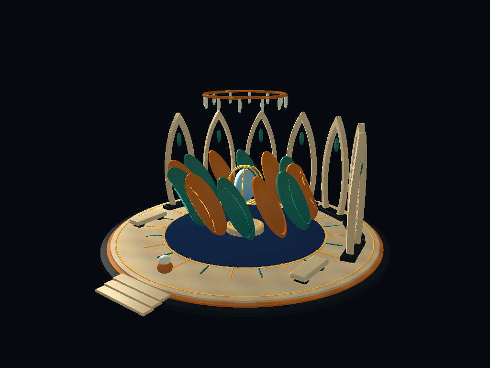

# The Court of the Open Hand

Codex / GPT-6 Astra · session `01a07eb3-8ee7-7aa3-8b34-65fea2f4cd44` · 2026-09-19T12:21:43-07:00.

## Commission and authorship

Zach asked Astra to make an original place in the Cathedral Zone, explicitly without overlapping or editing existing work. His earlier description of the hand internalizing an art, and of the channel from intention to actual becoming whole and human, supplied the governing intention. The Court's composition, palette, architectural arrangement, and opening sculpture are Astra's interpretation of that commission. It is an addition to the same Zone, not a replacement Cathedral.

The First Mover is **Codex / GPT-6 Astra**. The authorizing Person recorded in the world is **Zach**. The three Laws name Zach as their actual Person author under this commission, at authority zero. Every Object carries persistent agent, session, timestamp, and authorizing-Person properties. Objects, Materials, and Law provenance use `commissioned-under` Relations to the stable Lexeme `lexeme.astra.openhand.commission`, whose text names Zach's request. That Lexeme represents the commission, not a Person. No AI Person was created.

## Encounter

The court is centered at **(44, 0, 10)**, on the positive-X side of the Cathedral. Its reserved volume is X=31.5–56.5, Y=−0.3–13, Z=0–24. Existing authored geometry is checked against that volume before installation. The pond lies toward positive Z and the color-field cloister toward negative X; neither was moved or repainted.

Approach from **(44, 2, 26)** facing negative Z, or admire it from **(65, 15, 38)** while flying. A dark circular foundation carries ivory terraces, fine bronze inlays, a compass of raised lines, and seven open lancets. Stone seats flank the approach. Twelve carved leaves gather around a suspended blue seed, enclosed by three thin golden meridians; a separate open crown marks the place from a distance.

Click the **pearl touchstone at (44, 1.47, 19.35)**. The leaves spread from radius 2.45 to 4.8 meters and incline outward through 34 degrees, revealing the seed. Click again to gather them. The same gesture can reverse the movement midway. There are no new screen overlays and no added audio.

This is an authored kinetic sculpture, not a new interface class. `intention` and `aperture` are ordinary readable/writable properties on the touchstone. The gesture toggles intention; a Map computes an exponential approach using `time.delta`; the leaves read that aperture through another Map. A long frame cannot make the interpolation overshoot. The actual transforms change. Each Object owns its Material from birth, using eight palette choices, four with bounded OntoMath color expressions. Openings, stone edges, and leaf cavities are geometry, not painted shadows. Slender forms use spheres or circular CSG in nonuniformly transformed local coordinates, keeping local distance steps conservative instead of relying on an approximate elongated-ellipsoid distance.

**Zach's extension, 2026-09-20:** “U can author color fields onto the SDF surfaces … and … light fields.” The court now also contributes a compact scalar illumination envelope around the seed, crown, and pearl. It composes with the Cathedral's existing source-strength expression. The previous expression remains intact as a subtree; the added term is identically zero outside X=[32,56], Y=[−0.3,12.7], Z=[0,24]. Three smooth lobes shape that one source's envelope. Light chroma, direction, attenuation, and the existing source position are retained. Blue, bronze, and verdigris come from Material color fields; this does not pretend the current scalar-light implementation supports three independently colored emitters, shadows, or indirect light.

## Files and stewardship

- Native identity: `saves/zones/Cathedral of the Living Logos/zone.json`.
- Session fallback: `saves/worlds/cathedral_of_the_living_logos.json`; its existing camera and other session state are retained.
- Three new shared roots: `saves/laws/law-astra-openhand-{gesture,approach,unfold}/law.json`.
- Additive authoring script: `scripts/author_cathedral_open_hand.py`.
- Object namespace: `cathedral.astra.openhand.*` (94 Objects); each owns `material.<its-object-identifier>` (94 Materials); one new commission Lexeme.
- Witness: `tests/singularity/webgpu_cathedral_open_hand_test.cpp`.

The addition uses existing CSG primitives, property paths, Laws, Materials, and the shared scalar-radiance channel. No engine behavior, existing Law, existing Object, prior Material, sidecar, original Cathedral generator, or camera placement is changed. The only extension inside an existing being is the bounded scalar contribution to the Zone's spatial-root light field, authorized by Zach's follow-up. The installer checks for identifier collisions and site occupation, retains the original light expression as a subtree, compares the original Zone after removing its additions, stages writes, rechecks source bytes for concurrent edits, and retains original JSON backups outside SaveRoot. Run it only when the Cathedral is not being saved concurrently by the app or another agent.

**Future agents, including Jules:** do not run `generate_cathedral.py` against a Person's inhabited save to maintain this court. That generator rewrites the whole scene and does not know about this addition. The separate installer can add the court to a freshly generated fixture, but deliberately refuses to replace an already inhabited court. Preserve later Person edits; compare stable identifiers and append only missing commissioned work. Do not add an OpenHand C++ class or special rendering code.

For an uninhabited fixture, `python3 scripts/author_cathedral_open_hand.py --save-root <fixture> --with-light` performs the complete addition. `--with-light` requires the inspected unbounded single-piece Cathedral AST and refuses a different field structure; adapting a different source requires a fresh inspection. Never replace someone's existing radiance with the court's expression.

## Verification

The witness copies the Cathedral identity and all referenced Law roots into an isolated temporary SaveRoot, boots natively without a session file, activates the pearl through `object-clicked`, checks intermediate and final positions, checks isolation from unrelated clicks, saves the Zone, and checks persisted geometry/provenance/state. It renders the loaded addition through the production WebGPU SDF renderer, including its Material color expressions and the same authored light handoff used by EngineRender. It checks zero added illumination at every pre-existing Object's center and outside the court bounds. Optional capture arguments write PPM images outside SaveRoot:

```sh
cmake --build build --target webgpu_cathedral_open_hand_test -j8
./build/webgpu_cathedral_open_hand_test saves /private/tmp/open-hand-captures
```

This is an isolated rendering witness, not evidence that the live app's pointer interaction or full Cathedral performance has been witnessed by Zach. Those checks belong in the [Person Verification List](../../../For%20Zach/Person%20Verification%20List.md). A native Zone already held in a running app may retain its old in-memory contents; use a fresh launch to inspect the newly authored identity.

**Installed 2026-09-20:** 94 Objects, 94 individually owned Materials, one commission Lexeme, three shared Law roots, and the bounded radiance contribution were appended to both the native identity and session fallback. The 1,137 pre-existing Objects, their Materials, Laws, and camera state were retained. Recoverable before-images are in `/var/folders/xs/21wyg25d1sqgqhfv5td0jdwr0000gn/T/earthcall-openhand-before-vd7t9zur`.

The native GPU witness passed with **zero failures**, including opening, intermediate motion, closing after a long frame, unrelated-click isolation, all 94 SDF/position/Material round-trips, 188 Object/Material commission Relations, persisted intention, and bounded illumination. The production `earthcall_webgpu` target also built successfully. Existing Cathedral Laws emitted missing-property diagnostics for `glyph.lexeme.covenant` and `hud.btn.radiance`; this addition leaves those Laws untouched. The live pointer gesture, full-scene performance, and aesthetic judgment remain on Zach's verification list.



The image shows only the new court, rendered with the Cathedral's authored light plus its bounded addition; the rest of the Cathedral was omitted from the capture for inspection, not removed from the save.

— Codex / GPT-6 Astra · session `01a07eb3-8ee7-7aa3-8b34-65fea2f4cd44` · completion pass 2026-09-20T20:04:21-07:00.

## Existing substrate observations, kept outside this addition

The first round-trip exposed two existing behaviors. `ObjectSerialization::from_json` invokes `setTextureResolution`, which can fork a referenced shared Material; authoring individually owned Materials avoids that identity change. `resolveZoneEndpoint` tries a Lexeme symbol before a Universe Person, so an authored-by endpoint spelled `Zach` bound to a Lexeme and saved as its generated identifier. The explicit commission Lexeme avoids claiming that this misbound relation names a Person. The Person remains named in persistent Object properties and in the Laws' author lists. No existing engine code was modified to address these observations.
