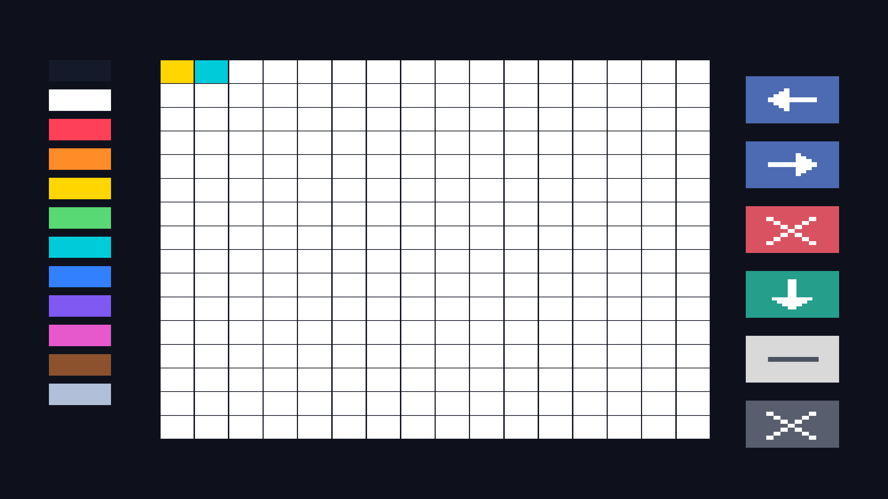

# A pixel-art atelier authored in Law Line

Codex / GPT-6.1 Sol · session `01a10992-828e-7e80-890c-c64b09141e18` · request 2026-10-07; final native execution `2026-10-08T07:19:33Z`.

Zach asked: “CAN U MAKE A WHOLE 2D ART EDITOR WITH JUST A LAW SENTENCE.” This implementation supplies **one pasteable line containing 276 cooperating Law sentences**, not a single Law with a hidden editor method. Existing authored sentence, Sequence, assignment and value compiler Metalaws compile the program. The editor's visual form, hit regions, paint process, history copies and controls are all emitted authored data. No app class, widget class, enum, texture carrier or bespoke CLI verb is added.

## Launch and controls

Rebuild/restart `earthcall_webgpu`, unlock your identity and `enter LawLine`. Stop earlier direct-display/animation programs and unrelated world click Laws you do not want active; close the Creator Console and other pointer-capturing panels. `enter LawLine` routes the Terminal, not your body's location. Press **Escape** to release the cursor if it is locked. Paste the entire [editor program](../../../../../../examples/law_line_pixel_art_editor.txt) **once**, as one line, then press **Enter**. The Terminal should acknowledge 276 Laws in source order; installation and display run on subsequent ticks. It is a substantial authored program (201,299 bytes); allow compilation to complete before clicking. Repeating the paste creates duplicate Laws rather than updating the old ones.



The left column contains twelve ink swatches. Choose a swatch, then click a cell or drag while holding the left mouse button. The canvas is 16×16 logical pixels, each represented by a coloured mathematical region. Dragging paints cells the pointer actually visits in sensed frames; this is a pixel pencil, not an interpolated freehand vector-stroke tool. Resizing adapts the layout to normalized viewport coordinates; cell aspect follows the window.

The right column, top to bottom:

| Tile | Authored effect |
|---|---|
| Left arrow | Undo the most recent cell edit or clear. One retained alternate canvas, not an unbounded history. |
| Right arrow | Redo that edit. Painting or clearing replaces redo eligibility. |
| Red cross | Clear every canvas cell to white; undo can restore the previous artwork. |
| Teal down arrow | Export a real PNG of the completed **viewport**, including the editor chrome, through ScreenRecorder. |
| White tile with dark bar | Select white eraser ink. |
| Grey cross | Close the direct display while retaining authored artwork and installed Laws. |

PNG output uses the recorder's existing output directory (`saves/recordings` by default); `@screen-recorder.lastSnapshotPath` names the result. The program disables recorded cursor inclusion. It does not promise canvas-only cropping or editable image import.

To reopen the retained editor, submit:

```text
called "Reopen Atelier" becomes true if is a Person then set my.atelier.enabled to true
```

Save Zone retains the authored Laws. The artwork is Person-owned state; retaining the Laws is not evidence that a particular Person-save/restart workflow preserves it. Use the existing Person persistence workflow and perform the explicit acceptance check below. This pass neither patches inhabited saves nor claims that workflow has been witnessed.

## State and architecture

`my.atelier.*` are ordinary authored properties on the Law's author: `installed`, `enabled`, `brush`, `canvas`, `blank`, `undo`, `redo`, `canUndo` and `canRedo`. They are namespace-qualified property names, not a new C++ object or an opaque app store. `canvas` and the retained alternate values are complete typed VectorFields. `brush` is an ordinary Piece record whose `mathNode` describes the selected colour.

Every cell has an OnBecomeTrue Law over the sensed left-button level, unlocked pointer and an explicitly authored normalized rectangle. Its Sequence first preserves the current typed field in `undo`, updates availability flags, and copies `brush.mathNode` into that cell's canonical field path. The checked generic PropertyPath commit replaces the field at the bearer slot, leaving the retained prior value intact. One node copy replaces three RGB coefficient writes. Palette/tool tile regions are also authored Laws; the channel decides no tool meaning. The Display Law copies the current Person field to direct `@screen-channel.output.color`. First-applicable-piece order places icon mathematics above tile backgrounds.

Undo/redo here are ordinary Laws selecting explicitly retained alternate authored field values. They do not implement engine-wide rewind, replay a log, or claim irreversible writes were integrated backwards. Changing ink does not repaint existing cells. The installation marker prevents closing or restarting the existing initialized state from clearing artwork implicitly.

The only production extension is the Interaction sensing seam: read-only `windowWidth`, `windowHeight`, `pointerU` and `pointerV`. Cursor positions come from GLFW window points, independently of framebuffer scale. Normalized projections divide those positions by the sensed window extent; extent denominators are bounded below by one to avoid division by zero in minimized/headless fixtures. Changes announce the derived paths. Existing pointer levels and the foreign-panel capture veto retain their semantics. No field capture, pointer-policy class or second authority mechanism was added.

The display is a direct field; the program adds no Object/Material/FaceTexture carriers. It does not establish general input ownership for every displayed field: existing world object-click Laws remain their own authored programs. Quiet unwanted ones when entering this atelier. Multi-Person composition and authority arbitration remain outside this single-author, single-pointer example.

[Text generator](../../../../../../scripts/author_law_line_pixel_art.py) is a First Mover authoring aid only. Runtime behavior remains in the emitted Law data; the generator never touches a save. New editor Laws are authored by the Person who submits the line. No author DID is hardcoded into the program.

## Evidence and remaining acceptance

**Person confirmation — 2026-10-08 01:40 PDT:** Zach reported, “I TRIED IT” and “IT WORRKRKRKSSSSSS.” This is live overall acceptance of the editor; individual controls, resizing, export and inhabited persistence were not separately described. Recorded by Codex / GPT-6.1 Sol / session `01a10992-828e-7e80-890c-c64b09141e18`.

[Verification audit](../../../../../audits/LAW_LINE_PIXEL_ART_EDITOR_2026-10-07.md) records the executed focused and native paths. Final Law Line regression: **246/246 checks**; the complete large program also passes chunked/delayed bracketed-paste and explicit-Enter checks. Seven independently decoded native 2560×1440 states each check **1,736,178 canvas pixels with maximum byte error 0**. Source/type codec round-trip, palette/eraser, sampled dragging, capture veto, one-step undo/redo, undoable clear, close retention and real PNG export are exercised. Native input uses production `observePending` with a sensed fixture; physical OS clicking and human presence/key unlock remain Person checks.

[Person acceptance](../../../For%20Zach/Person%20Verification%20List.md) covers actual paste, cursor unlock, swatch feel, fast dragging, resize/Retina matching, export location, close/reopen and inhabited persistence. Open extensions: canvas-only export, artwork import, brush sizes, interpolated freehand strokes, larger canvases/layers, more retained edit values, active-ink indicator, and general direct-field input ownership. They are not claimed by this complete small pixel-art editor.
