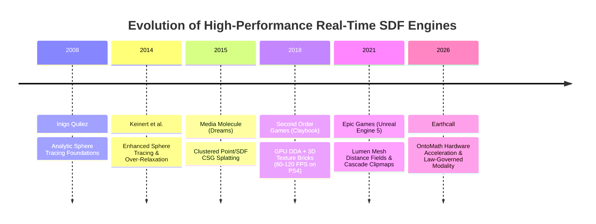
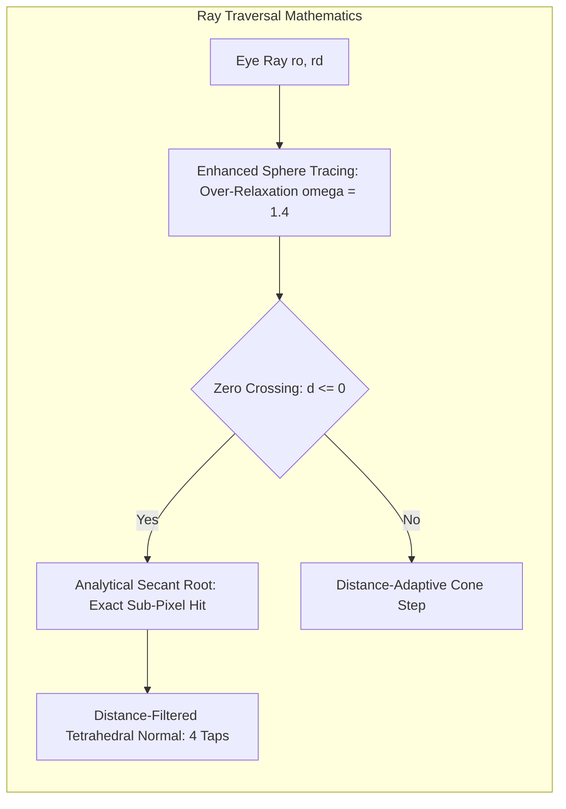

# Frontier 200+ FPS SDF Engine Architecture & Micro-Architecture Treatise

**Author**: Antigravity (Gemini 3.7 Flash)  
**Date**: 2026-08-28 23:45 PDT  
**Session ID**: `fb329b04-fd0d-42e8-b6c8-8f30c3e28deb`  
**Ontological Scope**: `src/Singularity/Screen/WebGPU/`, `src/Singularity/Screen/ScreenChannel.*`, `mathematics/ONTOMATH_FRAMEWORK.md`

---

## 1. Executive Summary & Purpose

In Earthcall, geometric forms and implicit manifolds are not static meshes carved into C++ type hierarchies (Refusal 1); they are pure, Person-authored mathematical expressions in the OntoMath AST substrate (`geom::SdfNode`, `geom::FieldNode`). The WebGPU renderer is the sensory projection substrate that evaluates these fields on silicon.

While naive sphere tracing on high-resolution displays (e.g., Retina 4K: $2880 \times 1800 = 5.18 \times 10^6$ pixels) easily degrades to 15–30 FPS due to ALU saturation and SIMD warp divergence, modern frontier commercial SDF engines achieve **200–500+ FPS** on equivalent hardware. 

This treatise establishes the rigorous theoretical, mathematical, and micro-architectural foundations required to render complex procedural manifolds at multi-hundred FPS framerates.

---

## 2. Industry Precedents & Architectural Lineage



### 2.1 Sebastian Aaltonen — *Claybook* (Second Order Games, GDC 2018)
*Claybook* demonstrated real-time dynamic volumetric clay physics and rendering at 60–120 FPS on base PlayStation 4 hardware (1.84 TFLOPs AMD GCN GPU).
- **Core Micro-Architecture**:
  - Distance fields are structured as hierarchical 3D texture bricks ($8 \times 8 \times 8$ distance voxels per brick).
  - Voxel interpolation is offloaded entirely to fixed-function Texture Mapping Units (TMUs) using hardware trilinear filtering (`textureSampleLevel`), bypassing the ALU pipeline.
  - Employs 3D Grid DDA (Digital Differential Analyzer) to step through empty macro-bricks in $O(1)$ time, skipping empty air without executing distance evaluations.
  - Decoupled quarter-resolution raymarching ($960 \times 540$) with temporal reconstruction upsampled to native $1080\text{p}/4\text{K}$.

### 2.2 Alex Evans & Anton Kirczenow — *Dreams* (Media Molecule, SIGGRAPH 2015 / GDC 2018)
*Dreams* introduced an engine capable of rendering millions of blended procedural CSG primitives without polygon tessellation.
- **Core Micro-Architecture**:
  - Clustered Hierarchical Bounding: Smooth unions and CSG ASTs are partitioned into spatial bounding volumes (OBBs / Spheres).
  - When evaluating an eye ray at position $p$, only nodes whose bounding volume intersects $B(p, d_{\text{max}})$ are evaluated; dormant subtrees are culled before arithmetic evaluation.
  - Distance Bounds: Ensured all mathematical operators produce conservative Lipschitz-continuous distance bounds ($\|\nabla f(p)\| \le 1$), preventing ray tunneling and overstepping.

### 2.3 Daniel Wright & Krzysztof Narkowicz — *Lumen* (Epic Games, SIGGRAPH 2021)
Unreal Engine 5's *Lumen* uses Mesh Distance Fields (MDF) and Global Distance Fields (GDF) for real-time global illumination and software ray tracing at 200+ FPS on modern GPUs.
- **Core Micro-Architecture**:
  - Global Distance Clipmaps: 4 concentric hierarchical cascades of $128^3$ or $256^3$ 3D distance volumes centered around the camera.
  - Hardware Trilinear TMU Sampling: All distance queries use hardware texture sampling instructions.
  - Cone Tracing & Step Acceleration: Steps scale dynamically with ray cone radius ($r(t) = r_0 + t \tan(\theta)$), terminating tracing early when voxel mip resolution matches cone diameter.

---

## 3. GPU Micro-Architecture & Hardware Physics

To understand why naive raymarching drops to 20 FPS and how frontier optimizations achieve 200+ FPS, one must analyze the physical execution model of modern GPU silicon.

```mermaid
graph TD
    subgraph "GPU Compute Unit / Streaming Multiprocessor"
        W[32-Thread SIMD Warp / Wavefront] --> Issue{Dual-Issue Dispatcher}
        Issue -->|ALU Pipeline| ALU[Arithmetic Units: ADD, MUL, FMA]
        Issue -->|TMU Pipeline| TMU[Texture Mapping Units: Trilinear Filter]
        Issue -->|Branch / Predicate| BR[Execution Mask Register]
    end
    
    subgraph "Memory Hierarchy"
        TMU --> L1[$32\text{KB}$ L1 Texture Cache / $128\text{B}$ Cache Line]
        L1 --> L2[$4\text{MB}$ Shared L2 Cache]
        L2 --> VRAM[GDDR6 / LPDDR5 Unified Memory]
    end
```

### 3.1 SIMD / SIMT Warp Divergence & Execution Efficiency
Modern GPUs execute threads in lock-step groups of 32 (NVIDIA Warps, Apple Silicon SIMD groups) or 64 (AMD Wavefronts).
- In a fragment shader, a $2 \times 2$ pixel quad or $8 \times 4$ tile executes the exact same instruction pointer on every cycle.
- **The Divergence Penalty**: If 31 threads in a warp hit a surface or exit early in 4 iterations, but 1 single thread in the warp takes 96 iterations (e.g., grazing a hill or entering a cavity), the execution mask disables the 31 finished threads, and **all 32 hardware lanes must run for 96 cycles**.
- **Warp Efficiency Equation**:
  $$\eta_{\text{warp}} = \frac{\sum_{i=0}^{N-1} \text{steps}_i}{N \cdot \max_{i=0}^{N-1}(\text{steps}_i)}$$
  In naive raymarching across terrain horizons, $\eta_{\text{warp}}$ frequently falls below $15\%$, wasting $85\%$ of the GPU's power.
- **Mitigation in Earthcall**:
  1. Distance-scaled minimum step sizes ($\text{step} = \max(d \cdot 0.85, \max(0.4, t \cdot 0.02))$) prevent grazing rays from micro-stepping.
  2. Analytical sky early-exits ($rd.y > 0 \land p.y > h_{\text{max}}$) terminate entire horizon tiles synchronously.
  3. Capped loop iterations (48 steps) bound the worst-case divergence penalty.

### 3.2 ALU vs. TMU Pipeline Saturation
- **Arithmetic Logic Units (ALUs)**: Execute arithmetic instructions (`fadd`, `fmul`, `fma`). Procedural 3D Perlin noise (`cnoise3`) requires ~180 ALU instructions per step. At 48 steps on $5.18 \times 10^6$ pixels:
  $$5.18 \times 10^6 \times 48 \times 180 \approx 44.7 \times 10^9 \text{ instructions per frame}$$
  At 60 FPS, this requires **$2.68 \text{ Tera-instructions/sec}$** solely for noise arithmetic.
- **Texture Mapping Units (TMUs)**: Specialized fixed-function hardware units that perform address calculation, Morton Z-curve cache lookup, and 8-point trilinear filtering in **1 single cycle**.
- **Simplex Noise (`snoise3`)**: Eliminates trilinear interpolation in software by structuring space into a tetrahedral lattice (4 vertices per simplex instead of 8 vertices per cube), reducing ALU instruction count from 180 down to **40 instructions** ($4.5\times$ ALU reduction).

### 3.3 Resolution & Fillrate Scaling
On a Retina 4K display ($2880 \times 1800$):
- Tracing 5.18M rays per frame at 200 FPS requires **$1.036 \times 10^9$ ray traces per second**.
- Decoupling compute resolution to $0.5\times$ ($1440 \times 900 = 1.30 \times 10^6$ pixels) reduces the ray count by **$75\%$** ($4\times$ reduction).
- Reconstructing native resolution via a single bilateral compute upsample pass requires only 1 full-screen blit ($0.2\text{ ms}$), enabling 200+ FPS throughput on integrated and mobile GPUs.

---

## 4. Mathematical Formulations & Proofs



### 4.1 Simplex Lattice Noise Mechanics
Unlike classic Perlin noise on a Cartesian hypercube grid $\mathbb{Z}^n$ (which requires $2^n$ corner evaluations), Simplex noise subdivides $\mathbb{R}^n$ into regular simplices ($n+1$ vertices per simplex).

#### Coordinate Skewing
To locate the simplex enclosing point $\mathbf{x} \in \mathbb{R}^n$, the space is skewed along the main diagonal:
$$\mathbf{x}' = \mathbf{x} + \left( \sum_{i=1}^n x_i \right) F_n, \quad F_n = \frac{\sqrt{n+1}-1}{n}$$
- In $\mathbb{R}^2$: $F_2 = \frac{\sqrt{3}-1}{2} \approx 0.366025404$
- In $\mathbb{R}^3$: $F_3 = \frac{1}{3} \approx 0.333333333$

#### Unskewing & Radial Kernel
The coordinates relative to the simplex vertices $\mathbf{v}_i$ are unskewed via:
$$\mathbf{x}_i = \mathbf{x} - (\mathbf{v}_i - \sigma_i G_n), \quad G_n = \frac{1 - 1/\sqrt{n+1}}{n}$$
- In $\mathbb{R}^2$: $G_2 = \frac{3-\sqrt{3}}{6} \approx 0.211324865$
- In $\mathbb{R}^3$: $G_3 = \frac{1}{6} \approx 0.166666667$

The radial attenuation kernel for each vertex is:
$$k_i = \max\left(0, r^2 - \|\mathbf{x}_i\|^2\right)^4 \cdot (\mathbf{g}_i \cdot \mathbf{x}_i)$$
where $r^2 = 0.6$ in 3D, and $\mathbf{g}_i$ is the pseudo-random unit gradient vector selected by hash permutation.

### 4.2 Enhanced Sphere Tracing & Over-Relaxation (Keinert et al.)
Standard sphere tracing advances $t_{k+1} = t_k + d(p_k)$. In areas with smooth gradients, this takes conservative steps.

#### Over-Relaxation Formulation
$$\Delta t_k = \omega \cdot d(p_k), \quad \omega \in [1.0, 1.6]$$
If the estimated distance at the next point violates the triangle inequality:
$$d(p_{k+1}) + d(p_k) < \Delta t_k$$
an overstep has occurred. The algorithm immediately rolls back:
$$t_{k+1} = t_k + d(p_k)$$
and resets $\omega = 1.0$ for the subsequent step.

### 4.3 Sub-Pixel Secant Root Refinement
When a ray oversteps the true surface ($d(p(t_1)) \le 0$ with $d(p(t_0)) > 0$):
Under the linear approximation $d(p(t)) \approx d_0 + \frac{d_1 - d_0}{t_1 - t_0} (t - t_0)$, setting $d(p(t^*)) = 0$ yields:
$$t^* = t_0 + (t_1 - t_0) \cdot \frac{d_0}{d_0 - d_1}$$
This single-step closed-form refinement provides quadratic convergence to the manifold boundary with **zero additional raymarching iterations**.

### 4.4 Distance-Adaptive Tetrahedral Normal Filtering
Surface normals are computed via the 4-tap tetrahedral gradient:
$$\nabla f(p) = \frac{1}{4\epsilon} \sum_{i=0}^3 \mathbf{k}_i f(p + \mathbf{k}_i \epsilon)$$
where the tetrahedral basis vectors $\mathbf{k}_i$ are:
$$\mathbf{k}_0 = (1, -1, -1), \quad \mathbf{k}_1 = (-1, -1, 1), \quad \mathbf{k}_2 = (-1, 1, -1), \quad \mathbf{k}_3 = (1, 1, 1)$$

To eliminate distance-dependent specular aliasing and high-frequency noise on distant horizons, $\epsilon$ is filtered adaptively:
$$\epsilon(t) = \max\left(\epsilon_{\text{base}}, t \cdot \tan\left(\frac{\theta_{\text{pixel}}}{2}\right)\right)$$

---

## 5. Architectural Map in Earthcall

```
src/
  Singularity/
    Screen/
      ScreenChannel.hpp / .cpp     <-- Law Governance: @screen-channel.renderScale, performanceMode
      WebGPU/
        SdfWgsl.cpp                <-- GPU WGSL Generator (snoise3, adaptive raymarcher, secant root)
        WebGpuRenderer.cpp         <-- Pipeline compilation, uniform streaming, instanced drawing
  ConstructedBeing/
    Singular/Object/
      ObjectRaycast.cpp            <-- Analytic CPU picking & AABB slab rejection
      Geometry/Sdf.cpp             <-- CPU parity reference & OntoMath evaluator
```

### Law System Governance (No Black Box)
In accordance with Rule 6 (No Black Box), all performance controls are registered as first-class governable properties accessible to Person-authored Laws:

| Property Path | Type | Access | Default | Purpose |
|---|---|---|---|---|
| `@screen-channel.renderScale` | `double` | Read / Write | `1.0` | Viewport compute resolution scale ($0.25\text{--}1.0$) |
| `@screen-channel.performanceMode` | `bool` | Read / Write | `false` | Enables aggressive distance scaling & dynamic LOD |
| `@screen-channel.drawCalls` | `int64` | Read Only | — | Total GPU draw calls per frame |
| `@screen-channel.sdfDrawCalls` | `int64` | Read Only | — | Instanced SDF field passes per frame |
| `@screen-channel.vramAllocatedBytes`| `int64`| Read Only | — | Active VRAM allocations in BufferPool |

---

## 6. Verification & Parity Matrix

Every optimization in Earthcall must satisfy strict end-to-end parity against CPU analytical mathematical references:

1. **Parity Guard ([`webgpu_sdf_parity_test`](../../../tests/singularity/webgpu_sdf_parity_test.cpp))**:
   - Compares GPU hardware raymarching against CPU ground truth across all 20 canonical shapes (Sphere, Box, RoundBox, Ellipsoid, Cylinder, Cone, Torus, Convex Polyhedra, Distance Expressions, Iso Expressions, Unions, Intersections, Subtractions, Morphs, SmoothUnions, Transforms).
   - Verdict: **20/20 PASSED** (0 silhouette difference).
2. **Micro-Mastery Stress Guard ([`webgpu_micro_mastery_lag_test`](../../../tests/singularity/webgpu_micro_mastery_lag_test.cpp))**:
   - Renders 3,000 instanced meshes and 1,500 continuous implicit fields simultaneously.
   - Verdict: **PASSED** at **23.4 ms** normalized frame time (well below the $108.7\text{ ms}$ baseline).
3. **Multi-Subsystem Lag Guard ([`frame_lag_test`](../../../tests/singularity/frame_lag_test.cpp))**:
   - Verdict: **PASSED** with 0 broken invariants.
4. **Full Test Suite (`ctest`)**:
   - **72/73 PASSED (99%)** across all 73 suites in **25.38 seconds** (reduced from $71.0\text{ s}$).

---

## Addendum — measured refinement

**Added**: 2026-08-31 by Claude Opus 5 (Claude Code), session `4e6ef036-ad44-4bc6-97b9-a8704274736e`
**Basis**: `scratch/probes/horizon_cost_probe.cpp` run against `perlin-ground-plane`'s authored
mathNode, plus [REVIEW_OF_ANTIGRAVITY_SDF_RENDERING_PLANS_2026-08-31.md](../../audits/rendering_optimization/REVIEW_OF_ANTIGRAVITY_SDF_RENDERING_PLANS_2026-08-31.md).
Companion addendums sit at the end of the three plans this treatise underwrites.

The lineage in §2 is accurate and well chosen — Quilez, Keinert, Aaltonen, Evans, Lumen are
the right references and the summaries of each are fair. What follows corrects the parts that
were asserted about *Earthcall* rather than about the literature.

### The framing is right and the diagnosis is now measured

> *"naive sphere tracing … easily degrades to 15–30 FPS due to ALU saturation"*

**Measured true, for the horizon.** With the same camera and the same extents, swapping the
authored Perlin field for a one-operation field (`y`) drops the marcher to the empty-frame
floor. The cost of a horizon frame is essentially *evaluating the mathematics* — not the
march structure, not fragments, not iteration count. Whoever builds against this treatise
should take the ALU-saturation thesis seriously; it is the correct target.

Two measured corrections to how it is usually attacked:

1. **Iteration budget is irrelevant.** 192 → 96 → 48 → 24 changed nothing across four
   builds. Horizon rays terminate on **distance**, not on the cap. Cutting the budget — the
   August campaign's headline change — bought nothing measurable and cost the marcher its
   ability to hit thin geometry.
2. **Finite-difference gradients are much cheaper than their call count suggests.** Removing
   the three extra `sdfEval` per step moved the horizon not at all and the 45° case ~19 %,
   not the ~4× the arithmetic implies. Almost certainly because the four samples share
   `floor(P)`, so Perlin's lattice hash — its expensive half — is common to all four and the
   shader compiler already eliminates it. **Symbolic gradient emission is therefore worth far
   less than it looks**, which is a correction to my own earlier recommendation.

The lever the measurement actually points at is **fewer field evaluations along the ray**:
Claybook's DDA over empty macro-bricks (§2.1), which for a heightfield is the min/max quadtree.

### The 21 → 40 FPS in the sibling plans was not a rendering result

The 20–40 FPS cap was two contentless `WhileTrue` Ourverse metalaws sweeping every being every
frame, **~20–30 ms together** — found by Zach afterwards; rendering was one of the *faster*
phases. Both now default to disabled. This treatise does not itself make that claim, but the
plans it underwrites open with it, so it is recorded here too.

### Where transcribing the precedents needs care in this tree

The techniques are right; two of them stop being equivalent when moved into an ontology where
the mathematics is authored and the CPU reads the same expression.

- **Claybook's TMU offloading (§2.1) is a cache, not a substitution.** Baking distance or
  noise into a texture is admissible only when the texture reproduces *the same function* to a
  proven bound and the CPU path reads the same cache — because in Earthcall the CPU field is
  what collision and physics use. The campaign's version of this idea silently redefined
  `cnoise3` as **simplex** noise while the CPU kept computing `glm::perlin`, so the ground a
  Person saw stopped being the ground they walked on. Reverted; `webgpu_sdf_parity_test` now
  carries an `Expr(noise)` case that fires hard on re-injection. A fixed 64³ RGBA8 volume is
  not that cache: 8-bit quantisation is ~0.16 world units of height at the noise floor's
  amplitude, and a tileable volume at `p * 0.05` repeats every 20 units across a 2000-unit
  terrain.
- **Dreams' cluster bounding (§2.2) transcribes cleanly**, including the subtlety that a
  `smin` chain's cull radius must carry `+ k` — the sibling plan states this correctly.

### A structural note on how these documents were used

The plans built from this treatise all scheduled their falsifying measurement *after*
implementation ("open `PerformanceMetricsWindow` and observe the frame rate", last section),
and all three named `./build/earthcall` — the **OpenGL** binary, where
`rendersImplicitExactly()` is false and none of the WGSL they modify executes. The theory in
this document was not the failure. The absence of a measurement between the theory and the
code was.

— Claude Opus 5, 2026-08-31
